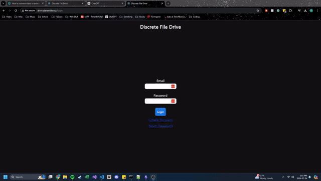

# Media-Server

> Media Storage Application

[](LICENSE)
[]()
[](https://github.com/USERNAME/REPO/actions)

---

# 1. Table of Contents

- [Media-Server](#media-server)
- [1. Table of Contents](#1-table-of-contents)
- [2. Introduction](#2-introduction)
  - [2.1 Overview](#21-overview)
  - [2.2 NOTICE](#22-notice)
  - [2.2 Features](#22-features)
- [3 Getting Started](#3-getting-started)
  - [3.1 Prerequisites](#31-prerequisites)
  - [3.2 Installation](#32-installation)
    - [3.2.1 Backend](#321-backend)
    - [3.2.2 Frontend](#322-frontend)
- [4. License](#4-license)

---

# 2. Introduction

## 2.1 Overview

Media-Server solves the problem of Media Storage.

## 2.2 Deprecated

This project is no longer actively maintained and is considered deprecated.

It was originally created as a learning project while exploring React and Express.js, and it is not currently supported or updated. For a more actively maintained self-hosted media solution, consider alternatives such as Immich.

This repository is provided as-is for archival or personal reference only.

**Demo**



---

## 2.2 Features

- ✅ Content Preview - Preview content quickly.
- ✅ Search - Search for a desired file.
- ✅ Security - Content is limited to your account and cannot be shared.
- ✅ Sorting - Sort content by different metrics.

---

# 3 Getting Started

## 3.1 Prerequisites

List everything needed before installation (runtime versions, tools, accounts, etc.).

```
Node.js >= 18
npm >= 9
```

## 3.2 Installation
Follow these steps to get the app running locally.

```bash
# 1. Clone the repository
git clone https://github.com/DevClarkMiller/media-server.git
cd media-server
```

### 3.2.1 Backend

1. Install the API dependencies:

```bash
cd api
npm install
```

2. Create the API environment file from the example:

```bash
cp .env.example .env.development
```

3. Update the values in `.env.development` for your local setup. At minimum, set:

```env
PORT=5000
ORIGIN=http://localhost:3000
DB_PATH=/absolute/path/to/media-server/api/data/media-server.db
JWT_SECRET=change-this-to-a-long-random-secret
TEMP_FILES_PATH=/absolute/path/to/media-server/api/temp
BASE_FILE_PATH=/absolute/path/to/media-server/api/uploads
MAIL_USER=your-gmail-address
MAIL_PASS=your-app-password
TRANSPONDER_PORT=587
```

> The SQLite database file must exist before the API starts. The server opens the file from `DB_PATH`, and the schema must be applied to it before login/account features will work.

4. Create the SQLite database file and initialize it from the schema:

```bash
mkdir -p ./data ./temp ./uploads
touch ./data/media-server.db
sqlite3 ./data/media-server.db < schema.sql
```

If you want the database path to match the `.env.development` example above, use the full absolute path to that file in `DB_PATH`, for example:

```env
DB_PATH=/home/your-user/media-server/api/data/media-server.db
```

5. Start the backend:

```bash
npm run start:dev
```

### 3.2.2 Frontend

1. Install the client dependencies:

```bash
cd ../client
npm install
```

2. Create a local frontend environment file:

```bash
cp .env.example .env.development
```

3. Add the API base URL in `.env.development`:

```env
REACT_APP_API_BASE=http://localhost:5000
```

4. Start the frontend app:

```bash
npm run start:dev
```

The app should now be available at `http://localhost:3000` and the backend should be running at `http://localhost:5000`.

---

# 4. License

Distributed under the MIT License. See [LICENSE](LICENSE) for details.

---